# Complete User Flow Diagram - K&M Event Management System

This diagram represents the complete user journey through the entire MERN stack application, from entry to all possible actions across different user roles.

## System Overview

**Technology Stack**: MERN (MongoDB, Express.js, React, Node.js)
**Payment Gateway**: Razorpay
**Authentication**: JWT + Google OAuth
**QR Encryption**: AES-256-GCM
**Roles**: Guest, User, Event Admin, Admin, Staff Admin, Staff, Super Admin

---

## Complete User Flow Diagram

```mermaid
flowchart TD
    Start[User Visits Website] --> HomePage{User Type?}
    
    HomePage -->|Not Logged In| PublicBrowse[Browse Events/Home Page]
    HomePage -->|Logged In| Dashboard{Role?}
    
    PublicBrowse --> ViewEvents[View Public Events]
    ViewEvents --> SelectEvent{Select Event}
    SelectEvent -->|Event Page| EventDetail[View Event Details<br/>Check Availability<br/>See Price & Tickets]
    EventDetail --> BookOrLogin{User Logged In?}
    
    BookOrLogin -->|No| AuthChoice{Auth Type?}
    AuthChoice -->|Email| SignupPage[Signup Page]
    AuthChoice -->|Google| GoogleLogin[Google OAuth Login]
    GoogleLogin --> RegisterOAuth[Register via Google<br/>Create User Account]
    SignupPage --> ValidateEmail[Validate Email<br/>Check Password Requirements]
    ValidateEmail --> CreateUser[Create User with Role='user'<br/>Set Password]
    CreateUser --> LoggedInUser[User Authenticated<br/>JWT Token Created]
    
    BookOrLogin -->|Yes| BookFlow[Proceed to Booking]
    LoggedInUser --> BookFlow
    
    BookFlow --> SelectTicketType{Has Multiple<br/>Ticket Types?}
    SelectTicketType -->|Yes| ChooseType[Select Ticket Type<br/>Check Availability]
    SelectTicketType -->|No| EnterQty[Enter Quantity<br/>Check Stock]
    ChooseType --> EnterQty
    EnterQty --> CheckStock{Tickets<br/>Available?}
    
    CheckStock -->|No| WaitlistJoin{Join Waitlist?}
    WaitlistJoin -->|Yes| JoinWaitlist[Join Waitlist<br/>Receive Notification<br/>When Tickets Available]
    WaitlistJoin -->|No| End1[End - No Action]
    
    CheckStock -->|Yes| ApplyCoupon[Apply Coupon Code<br/>Optional]
    ApplyCoupon --> ValidateCoupon{Coupon Valid?}
    ValidateCoupon -->|No| ShowError[Show Error<br/>Invalid Coupon]
    ShowError --> ApplyCoupon
    ValidateCoupon -->|Yes| CalcDiscount[Calculate Discount<br/>Update Total Amount]
    
    ApplyCoupon -->|Skip| FinalAmount[Show Final Amount<br/>Tax Included]
    CalcDiscount --> FinalAmount
    FinalAmount --> PaymentCheck{Price > 0?}
    
    PaymentCheck -->|No| CreateBooking[Create Booking<br/>No Payment Required<br/>Mark as Completed]
    PaymentCheck -->|Yes| InitPayment[Initiate Payment<br/>Create Razorpay Order]
    InitPayment --> SendOrderId[Send Order ID to Frontend<br/>Display Payment Modal]
    SendOrderId --> RazorpayModal[Razorpay Payment Gateway<br/>Enter Card/UPI Details]
    RazorpayModal --> PaymentGateway[Razorpay Processes Payment]
    PaymentGateway --> PaymentResult{Payment Status?}
    
    PaymentResult -->|Failed| PaymentFailed[Payment Failed<br/>Log in Payment DB<br/>Show Error Message]
    PaymentFailed --> RetryPayment{Retry?}
    RetryPayment -->|Yes| RazorpayModal
    RetryPayment -->|No| End2[End - Payment Cancelled]
    
    PaymentResult -->|Success| VerifySignature[Verify Payment Signature<br/>Razorpay API Validation]
    VerifySignature --> SignatureCheck{Signature Valid?}
    SignatureCheck -->|No| FraudAlert[Fraud Detected<br/>Log Security Event<br/>Reject Payment]
    FraudAlert --> End3[Payment Rejected]
    
    SignatureCheck -->|Yes| UpdatePayment[Update Payment Status<br/>Mark as 'completed'<br/>in DB]
    UpdatePayment --> CreateBooking
    
    CreateBooking --> GenerateBookingId[Generate Unique Booking ID<br/>e.g., BK-001-ABC123]
    GenerateBookingId --> CalcCommission[Calculate Commission<br/>Based on Organizer Plan<br/>Platform % + Organizer %]
    CalcCommission --> GenerateTickets[Generate Tickets<br/>Create Ticket IDs for Each Qty<br/>e.g., TK-A1B2C3, TK-X9Y8Z7]
    GenerateTickets --> GenerateQRCode[Generate QR Codes<br/>AES-256 Encrypted<br/>Contains Booking ID + Ticket ID]
    GenerateQRCode --> SaveBooking[Save Booking to DB<br/>Store QR Code Images<br/>Update Event Availability]
    SaveBooking --> SendEmail[Send Confirmation Email<br/>Attach Ticket PDFs<br/>Include QR Codes<br/>Add to Calendar Link]
    SendEmail --> BookingSuccess[Show Booking Success Page<br/>Display Booking ID<br/>Show All Tickets with QR]
    BookingSuccess --> MyBookings[User Redirects to My Bookings<br/>Can Download Tickets<br/>View QR Codes]
    
    MyBookings --> ViewMyBookings[View All Personal Bookings<br/>Status: Confirmed/Used/Cancelled<br/>Download Ticket PDF]
    ViewMyBookings --> End4[End - Guest User Flow Complete]
    
    Dashboard -->|Super Admin| AdminAuth{Authenticated?}
    AdminAuth -->|No| AdminLogin[Admin Login Page<br/>Enter Email + Password]
    AdminLogin --> AdminAuth
    AdminAuth -->|Yes| SuperAdminDash[Super Admin Dashboard]
    
    SuperAdminDash --> AdminChoice{Admin Action?}
    AdminChoice -->|User Management| UserMgmt[Manage All Users<br/>Create/Edit/Delete<br/>Assign Roles<br/>Disable/Reactivate]
    AdminChoice -->|Event Management| EventMgmt[View All Events<br/>Edit/Delete Events<br/>Manage Status<br/>View Analytics]
    AdminChoice -->|Booking Management| BookingMgmt[View All Bookings<br/>Search by Booking ID<br/>Search by Ticket ID<br/>Process Refunds]
    AdminChoice -->|System Config| SysConfig[System Configuration<br/>Security Settings<br/>Feature Toggles<br/>Email Templates]
    AdminChoice -->|Export Data| ExportData[Export Platform Data<br/>Users/Events/Bookings<br/>CSV/Excel/PDF Formats]
    
    Dashboard -->|Admin| AdminOperation[Admin Dashboard<br/>Platform Operations]
    AdminOperation --> AdminOps{Operation?}
    AdminOps -->|Manage Events| AdminEventMgmt[Create/Edit/Delete<br/>Events & Tickets]
    AdminOps -->|Team Management| TeamMgmt[Create Admin/Staff Users<br/>Assign to Events<br/>Manage Permissions]
    AdminOps -->|Booking Search| BookSearch[Search Bookings<br/>By ID/Email/Phone<br/>View Details & Status]
    AdminOps -->|Analytics| AdminAnalytics[View Platform Analytics<br/>Dashboard Metrics<br/>Revenue Reports]
    
    Dashboard -->|Event Admin| EventAdminDash[Event Admin Dashboard]
    EventAdminDash --> EventOps{Event Operation?}
    EventOps -->|View Events| MyEvents[View Assigned Events<br/>Only Events Organizer Created<br/>Or Admin Assigned]
    MyEvents --> EventStats[View Event Statistics<br/>Tickets Sold<br/>Revenue<br/>Attendees]
    EventStats --> ManageStaff[Assign Staff to Event<br/>Create Staff Users<br/>Assign to Gates<br/>Remove Staff]
    EventOps -->|Bookings| EventBookings[View Event Bookings<br/>Search Attendees<br/>Export Attendee List<br/>View Entry Logs]
    EventOps -->|Features| ToggleFeatures[Toggle Features<br/>Based on Subscription Plan<br/>Analytics/Scanner/Reports]
    EventOps -->|Coupons| EventCoupons[Create Event Coupons<br/>Set Discount %/Fixed<br/>Usage Limits<br/>Expiry Date]
    EventOps -->|Revenue| RevenueDash[View Revenue Dashboard<br/>Commission Breakdown<br/>Payout Requests]
    
    Dashboard -->|Staff Admin| StaffAdminDash[Staff Admin Dashboard]
    StaffAdminDash --> StaffOps{Staff Operation?}
    StaffOps -->|Staff Management| CreateStaff[Create Scanner Staff<br/>Assign Events<br/>Assign Gates<br/>Set Permissions]
    StaffOps -->|Entry Logs| ViewEntryLogs[View Entry Logs<br/>Scan History<br/>Filter by Time/Gate<br/>Export Data]
    StaffOps -->|Manual Entries| ApproveManual[Approve Manual Entries<br/>When QR Scan Fails<br/>Add Notes<br/>Override Validation]
    
    Dashboard -->|Staff Scanner| ScannerDash[Scanner Dashboard]
    ScannerDash --> ScanOps{Scan Operation?}
    ScanOps -->|Scan Ticket| ScanQR[Scan QR Code<br/>Or Enter Booking ID]
    ScanQR --> DecryptQR[Decrypt QR Code<br/>Extract Booking ID<br/>Extract Ticket ID]
    DecryptQR --> ValidateTicket{Ticket Valid?}
    ValidateTicket -->|Cancelled| ShowCancelled[Show Cancelled<br/>Block Entry<br/>Request Super Admin Approval]
    ValidateTicket -->|Already Used| ShowUsed[Show Already Scanned<br/>Display Previous Scan Time<br/>Block Entry]
    ValidateTicket -->|Invalid| ShowInvalid[Show Invalid<br/>Log Fraud Attempt<br/>Show Contact Support]
    ValidateTicket -->|Valid| MarkScanned[Mark Ticket as Scanned<br/>Record Time<br/>Save Staff Info<br/>Save Gate Info<br/>Log Device ID]
    MarkScanned --> ScanSuccess[Show Color: Green<br/>✓ Entry Approved<br/>Display Attendee Name]
    ScanSuccess --> LogEntry[Log Entry in EntryLog DB<br/>Increment Event Count<br/>Update Analytics]
    LogEntry --> NextScan{More Scans?}
    NextScan -->|Yes| ScanQR
    NextScan -->|No| ScanStats[View Scan Statistics<br/>Today's Count<br/>Total Entries<br/>Failed Scans]
    
    ScanOps -->|Manual Entry| RequestManual[Request Manual Entry<br/>Attendee Name<br/>Reasonable Effort<br/>Submit to Staff Admin]
    RequestManual --> PendingApproval[Pending Staff Admin<br/>Approval]
    PendingApproval --> StaffAdminReview[Staff Admin Reviews<br/>Verify Email/Name<br/>Check Payment Status<br/>Approve/Deny]
    StaffAdminReview --> ReviewResult{Approved?}
    ReviewResult -->|No| ManualDenied[Manual Entry Denied<br/>Notify Staff]
    ReviewResult -->|Yes| ManualApproved[Manual Entry Approved<br/>Mark Ticket as Scanned<br/>Add To Entry Logs]
    ManualApproved --> NextScan
    ManualDenied --> NextScan
    
    Dashboard -->|Event Organizer/User| OrganizerDash[Organizer Dashboard]
    OrganizerDash --> OrgChoice{Organizer Action?}
    OrgChoice -->|Create Event Request| InitEventRequest[Create Event Request<br/>Select Subscription Plan]
    InitEventRequest --> PlanSelect[Choose Plan<br/>Basic/Standard/Professional<br/>Enterprise]
    PlanSelect --> RequestForm[Fill Event Details<br/>Title/Date/Location<br/>Description/Image<br/>Request Features Based on Plan]
    RequestForm --> SubmitRequest[Submit Event Request<br/>Store in DB<br/>Notify Super Admin]
    SubmitRequest --> RequestPending[Event Request Status:<br/>Pending Review<br/>Can Edit Before Approval]
    RequestPending --> SuperAdminReview[Super Admin Reviews<br/>Approve/Reject<br/>Can Override Features]
    SuperAdminReview --> RequestStatus{Status?}
    RequestStatus -->|Rejected| Rejected[Event Rejected<br/>Notify Organizer<br/>Reason Provided]
    Rejected --> End5[End - Request Rejected]
    RequestStatus -->|Approved| ApprovedEvent[Event Approved!<br/>Role Upgraded: user→event_admin<br/>Event Created<br/>FeatureToggle Created]
    ApprovedEvent --> EventAdminDash
    
    OrgChoice -->|My Bookings| OrgBookings[View Personal Bookings<br/>As Regular User<br/>Can Download Tickets]
    
    UserMgmt --> End6[End - Admin Action]
    EventMgmt --> End6
    BookingMgmt --> End6
    SysConfig --> End6
    ExportData --> End6
    AdminOps --> End6
    EventBookings --> End6
    ManageStaff --> End6
    EventStats --> End6
    ToggleFeatures --> End6
    EventCoupons --> End6
    RevenueDash --> End6
    StaffOps --> End6
    ScanStats --> End6
    OrgBookings --> End6
    ShowCancelled --> End6
    ShowUsed --> End6
    ShowInvalid --> End6
    JoinWaitlist --> End1
    
    style Start fill:#4CAF50,stroke:#2E7D32,color:#fff
    style HomePage fill:#2196F3,stroke:#1565C0,color:#fff
    style LoginPage fill:#FF9800,stroke:#E65100,color:#fff
    style SignupPage fill:#FF9800,stroke:#E65100,color:#fff
    style RazorpayModal fill:#0085CA,stroke:#003D82,color:#fff
    style PaymentGateway fill:#0085CA,stroke:#003D82,color:#fff
    style PaymentSuccess fill:#4CAF50,stroke:#2E7D32,color:#fff
    style PaymentFailed fill:#F44336,stroke:#C62828,color:#fff
    style BookingSuccess fill:#4CAF50,stroke:#2E7D32,color:#fff
    style ScanSuccess fill:#4CAF50,stroke:#2E7D32,color:#fff
    style ApprovedEvent fill:#4CAF50,stroke:#2E7D32,color:#fff
    style End fill:#9C27B0,stroke:#6A1B9A,color:#fff
```

---

## Flow Breakdown by Module

### 🎫 **Guest/User Flow**
1. Visit website → Browse events
2. Select event → View details
3. Login/Signup (Email or Google OAuth)
4. Select tickets → Apply coupon (optional)
5. Payment via Razorpay
6. Receive booking confirmation + QR codes
7. Download tickets as PDF

### 👨‍💼 **Event Organizer Flow**
1. Login as user
2. Create event request → Select subscription plan
3. Wait for Super Admin approval
4. Upon approval: Role upgraded to `event_admin`
5. Access event admin dashboard
6. Manage events, bookings, staff, coupons, revenue

### 🛡️ **Super Admin Flow**
1. Login via `/super-admin/login`
2. Access full platform control
3. Manage users (create, edit, delete, assign roles)
4. Approve/reject event requests
5. View all bookings, events, analytics
6. Export platform data
7. Configure system settings

### 📊 **Admin Flow**
1. Login via `/admin/login`
2. Platform operations dashboard
3. Create/edit events & tickets
4. Manage team (Event Admins, Staff)
5. Search bookings by ID/email/phone
6. View analytics & revenue reports

### 🎭 **Event Admin Flow**
1. Login via `/event-admin/login`
2. View assigned events only
3. Manage event details, ticket types
4. View bookings & export attendee lists
5. Create/manage staff for events
6. Create event-specific coupons
7. View revenue & commission breakdown
8. Request payouts

### 👮 **Staff Admin Flow**
1. Login via `/staff-admin/login`
2. Manage scanner staff team
3. Assign gates/zones to staff
4. View entry logs & scan history
5. Approve/deny manual entry requests

### 📱 **Staff (Scanner) Flow**
1. Login via `/staff/login`
2. Scan QR codes or enter booking IDs
3. System validates ticket (checks cancelled/used/invalid)
4. Mark as scanned if valid
5. Log entry with timestamp, gate, device info
6. Request manual entry if QR fails
7. View scan statistics

---

## Key System Features

### 🔐 Security
- JWT token authentication
- Role-based access control (RBAC)
- AES-256-GCM QR encryption
- Payment signature verification
- Fraud detection & logging
- Device ID tracking

### 💳 Payment Integration
- Razorpay payment gateway
- Order creation & verification
- Signature validation
- Payment status tracking
- Refund processing
- Commission calculation

### 🎟️ Ticketing System
- Multiple ticket types per event
- Seat selection (optional)
- QR code generation per ticket
- Ticket ID generation (unique)
- PDF ticket download
- Email confirmation with calendar invite

### 📊 Analytics & Reporting
- Real-time event statistics
- Booking trends & revenue
- Commission tracking
- Entry log analytics
- Export to CSV/Excel/PDF

### 🎯 Advanced Features
- Waitlist management
- Coupon/discount system
- Subscription plans (4 tiers)
- Feature toggles per event
- Calendar integration (.ics)
- Email notifications
- Manual entry approval workflow

---

## Database Collections

| Collection | Purpose |
|------------|---------|
| `users` | User accounts, roles, sessions |
| `events` | Event catalog, tickets, status |
| `bookings` | Ticket bookings, QR codes, scans |
| `payments` | Payment records, Razorpay orders |
| `entrylogs` | Scan history, gate entries |
| `coupons` | Discount codes, usage tracking |
| `subscriptionplans` | Plan tiers & features |
| `featuretoggles` | Event-specific feature flags |
| `eventrequests` | Organizer requests pending approval |
| `commissions` | Commission records per booking |
| `waitlist` | Sold-out event waitlist |
| `systemconfig` | Global system settings |
| `securityevents` | Audit logs, fraud attempts |

---

## API Endpoints Summary

### Authentication
- `POST /api/auth/register` - User signup
- `POST /api/auth/login` - User login
- `POST /api/auth/admin/login` - Admin login
- `GET /api/auth/me` - Get current user
- `POST /api/auth/logout` - Logout

### Events
- `GET /api/events` - Browse all events
- `GET /api/events/:id` - Event details
- `POST /api/events` - Create event (protected)
- `GET /api/events/public/:slug` - Public event page

### Bookings
- `POST /api/bookings` - Create booking
- `GET /api/bookings/my` - User's bookings
- `GET /api/bookings/event/:eventId` - Event bookings
- `GET /api/bookings/:bookingId/ticket/:ticketIndex/pdf` - Download PDF

### Payments
- `POST /api/payments/create-order` - Create payment order
- `POST /api/payments/verify` - Verify payment
- `GET /api/payments/my-payments` - User payments

### Scanner
- `POST /api/scanner/scan` - Scan QR code
- `GET /api/scanner/ticket/:bookingId/status` - Check status
- `POST /api/scanner/manual-entry` - Request manual entry

### Admin (Super Admin)
- `GET /api/super-admin/users` - List all users
- `POST /api/super-admin/users` - Create user
- `PUT /api/super-admin/users/:userId/role` - Assign role
- `GET /api/super-admin/events` - All events
- `GET /api/super-admin/bookings` - All bookings

### Event Admin
- `GET /api/event-admin/events` - Assigned events
- `GET /api/event-admin/events/:eventId/bookings` - Event bookings
- `POST /api/event-admin/events/:eventId/staff` - Assign staff

### Coupons
- `POST /api/coupons/validate` - Validate coupon
- `POST /api/coupons` - Create coupon (admin)
- `GET /api/coupons` - List coupons (admin)

### Waitlist
- `POST /api/waitlist/join` - Join waitlist
- `GET /api/waitlist/my-waitlist` - User's waitlist entries
- `GET /api/waitlist/event/:eventId` - Event waitlist

---

## User Roles & Permissions

| Role | Access Level | Key Permissions |
|------|--------------|-----------------|
| **Super Admin** | Full system | All operations, user management, system config |
| **Admin** | Platform level | Event management, team management, analytics |
| **Event Admin** | Event-specific | Manage assigned events, bookings, staff, coupons |
| **Staff Admin** | Entry management | Create staff, assign gates, approve manual entries |
| **Staff** | Scanner only | Scan tickets, view status, request manual entry |
| **User** | Customer | Browse events, book tickets, view bookings |

---

## Technology Stack

### Frontend
- **Framework**: React 18
- **Routing**: React Router v6
- **State**: Context API
- **Styling**: Tailwind CSS
- **HTTP**: Axios
- **Build**: Vite

### Backend
- **Runtime**: Node.js
- **Framework**: Express.js
- **Database**: MongoDB + Mongoose
- **Auth**: JWT + Passport.js (Google OAuth)
- **Payment**: Razorpay SDK
- **Email**: Nodemailer
- **QR**: QRCode library + Crypto (AES-256-GCM)

### DevOps
- **Deployment**: Render
- **Environment**: dotenv
- **CORS**: cors middleware
- **Session**: express-session

---

## Conclusion

This complete user flow diagram represents the entire architecture of the K&M Event Management System, covering all user journeys from guest browsing to administrative operations across 6 distinct user roles with full CRUD operations, payment processing, QR validation, and comprehensive analytics.

**Status**: ✅ Production Ready
**Last Updated**: March 6, 2026
