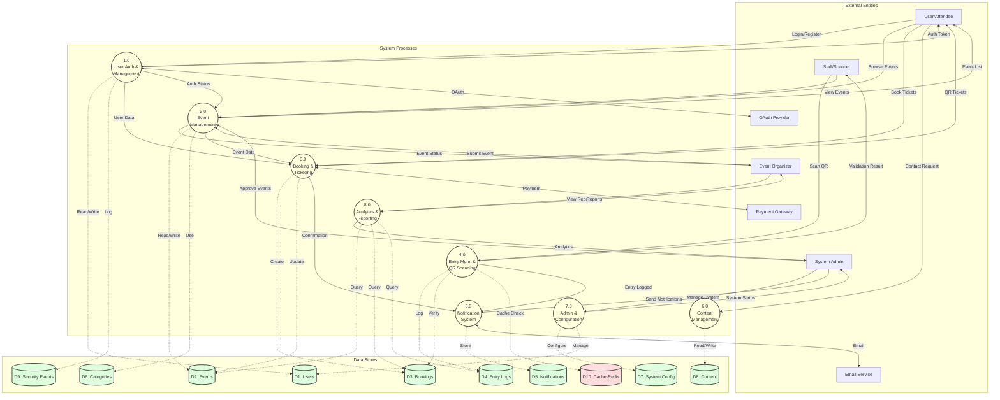
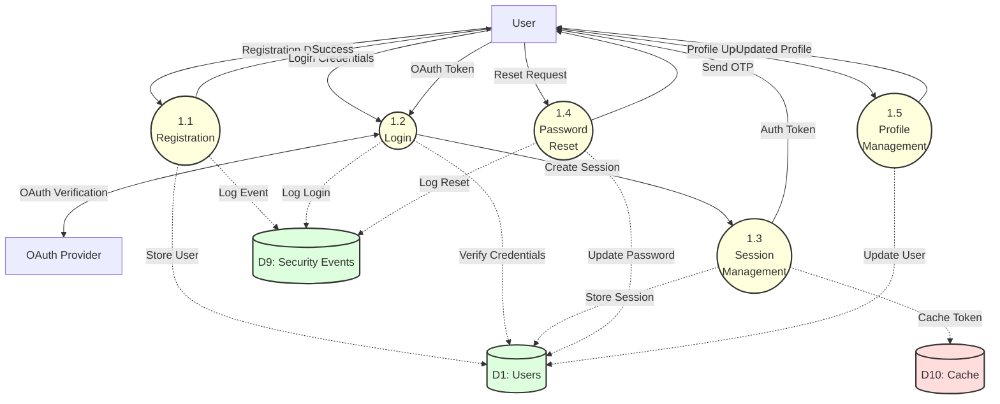
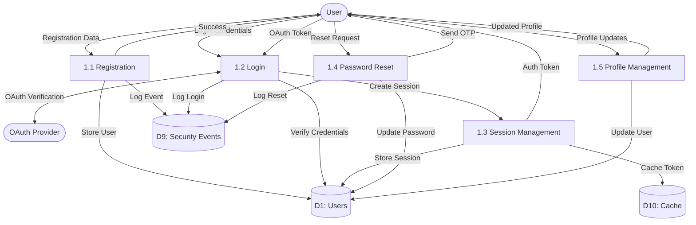
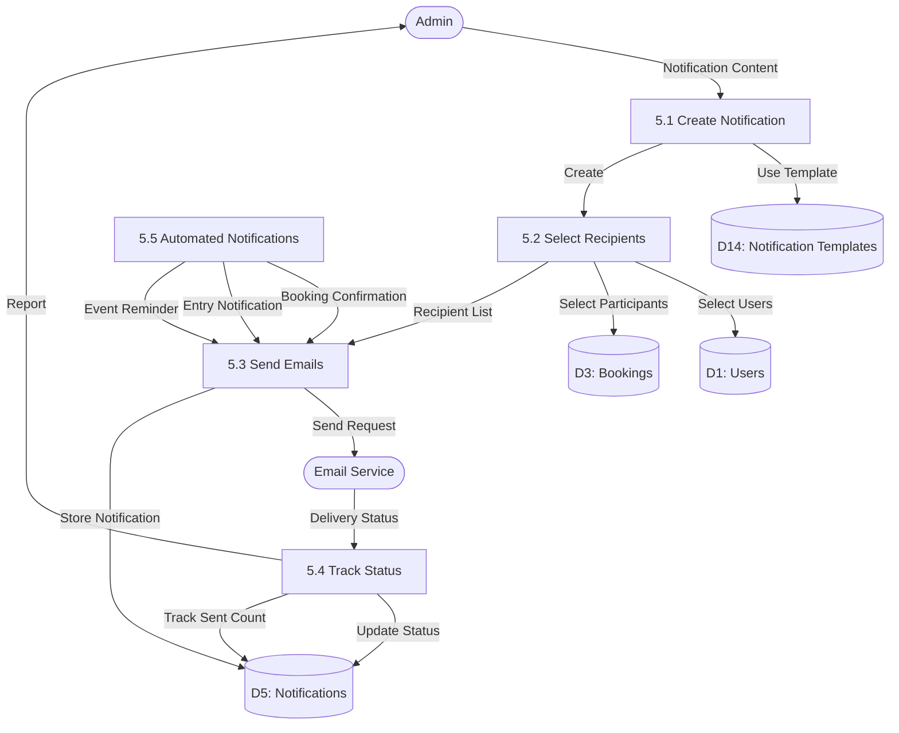
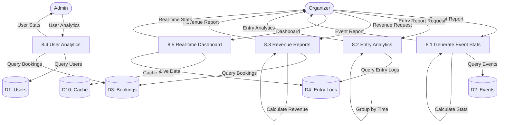

```mermaid
graph TB
    User[User/Attendee]
    Organizer[Event Organizer]
    Staff[Staff/Scanner]
    Admin[System Admin]
    Payment[Payment Gateway]
    Email[Email Service]
    OAuth[Google OAuth]
    
    System((K&M Event<br/>Management<br/>System))
    
    User -->|Registration/Login| System
    User -->|Browse Events| System
    User -->|Book Tickets| System
    User -->|Contact Support| System
    System -->|Event Details| User
    System -->|Booking Confirmation & QR Tickets| User
    
    Organizer -->|Submit Event Request| System
    Organizer -->|Manage Events| System
    Organizer -->|View Analytics| System
    System -->|Event Approval Status| Organizer
    System -->|Reports & Statistics| Organizer
    
    Staff -->|Scan QR Codes| System
    Staff -->|Log Entries| System
    System -->|Entry Validation Result| Staff
    System -->|Scan Results| Staff
    
    Admin -->|Manage Users| System
    Admin -->|Approve Events| System
    Admin -->|Configure Settings| System
    Admin -->|Send Notifications| System
    System -->|System Reports| Admin
    
    System -->|Payment Request| Payment
    Payment -->|Payment Status| System
    
    System -->|Send Emails| Email
    Email -->|Delivery Status| System
    
    System -->|Auth Request| OAuth
    OAuth -->|User Credentials| System
    
    style System fill:#f9f,stroke:#333,stroke-width:4px
    style User fill:#bbf,stroke:#333,stroke-width:2px
    style Organizer fill:#bbf,stroke:#333,stroke-width:2px
    style Staff fill:#bbf,stroke:#333,stroke-width:2px
    style Admin fill:#bbf,stroke:#333,stroke-width:2px
    style Payment fill:#bfb,stroke:#333,stroke-width:2px
    style Email fill:#bfb,stroke:#333,stroke-width:2px
    style OAuth fill:#bfb,stroke:#333,stroke-width:2px
```

# Data Flow Diagram (DFD) - K&M Event Management System

## Level 0: Context Diagram

### Mermaid Diagram


### Traditional Notation
```
                                          ┌──────────────────┐
                                          │                  │
        Booking request                   │      User/       │     Event details
      ─────────────────────────────────>  │    Attendee      │  <──────────────────
                                          │                  │
        QR tickets & confirmation         │                  │     Booking status
      <─────────────────────────────────  │                  │  ─────────────────>
                                          └────────┬─────────┘
                                                   │
                                                   │ Browse events
                                                   │ Book tickets
                                                   │
                    ┌──────────────────┐           │           ┌──────────────────┐
                    │                  │           │           │                  │
                    │  Event Organizer │           │           │  Payment Gateway │
                    │                  │           │           │                  │
                    └────────┬─────────┘           │           └────────┬─────────┘
                             │                     │                    │
         Event request       │                     │                    │ Payment status
         Management requests │                     ▼                    │
                             │          ╔══════════════════════╗        │
                             │          ║                      ║        │
                             └────────> ║   K&M Event          ║ <──────┘
                                        ║   Management         ║
         Reports & analytics            ║   System             ║   Payment request
                             ┌────────  ║                      ║  ──────────────────>
                             │          ╚══════════════════════╝
                             │                     │
                    ┌────────┴─────────┐           │           ┌──────────────────┐
                    │                  │           │           │                  │
                    │  Event Organizer │           │           │  Email Service   │
                    │                  │           │           │                  │
                    └──────────────────┘           │           └────────┬─────────┘
                                                   │                    │
                                                   │                    │ Delivery status
                                                   │                    │
                                          ┌────────┴─────────┐          │
                                          │                  │  <───────┘
                                          │  Staff/Scanner   │
                                          │                  │  Email notifications
                                          └────────┬─────────┘
                                                   │
         Entry validation result                   │
      <──────────────────────────────────          │
                                                   │ QR scan
         Scan QR codes                             │ Entry logs
      ───────────────────────────────────>         │
                                                   │
                                          ┌────────┴─────────┐
                                          │                  │
                                          │  System Admin    │
                                          │                  │
                                          └──────────────────┘
                                                   │
                                                   │ Manage system
                                                   │ Approve events
                                                   │ Send notifications
                                                   │
                                                   ▼
                                            System reports
```

## Level 1: Main Process Diagram

### Mermaid Diagram


### Traditional Notation
```
┌──────────────┐                                                    ┌──────────────┐
│              │  Login/Register                                    │              │
│     User     │─────────────────────┐                              │  Organizer   │
│   Attendee   │                     │                              │              │
│              │  Event list         │                              └──────┬───────┘
└──────┬───────┘                     │                                     │
       │                             ▼                                     │
       │                      ╔══════════════╗                             │
       │  Booking request     ║              ║      Event request          │
       └─────────────────────>║      1.      ║<────────────────────────────┘
                              ║  User Auth   ║
       ┌──────────────────────║      &       ║──────────────┐
       │  Auth token          ║  Management  ║              │
       │                      ╚══════════════╝              │
       │                             │                      │
       │                             │ User data            │ Security logs
       │                             │                      │
       ▼                             ▼                      ▼
┌──────────────┐              ┌─────────────┐        ┌─────────────┐
│              │              │             │        │             │
│   User DB    │              │  Session DB │        │ Security DB │
│      D1      │              │     D1.1    │        │     D9      │
└──────────────┘              └─────────────┘        └─────────────┘


┌──────────────┐                                                    ┌──────────────┐
│              │  Submit event                                      │              │
│  Organizer   │─────────────────────┐                              │    Admin     │
│              │                     │                              │              │
└──────────────┘                     │                              └──────┬───────┘
       ▲                             ▼                                     │
       │                      ╔══════════════╗                             │
       │  Event status        ║              ║      Approve/Reject         │
       └──────────────────────║      2.      ║<────────────────────────────┘
                              ║    Event     ║
       ┌──────────────────────║  Management  ║──────────────┐
       │  Event details       ║              ║              │
       │                      ╚══════════════╝              │
       │                             │                      │
       │                             │ Event data           │ Category usage
       │                             │                      │
       ▼                             ▼                      ▼
┌──────────────┐              ┌─────────────┐        ┌─────────────┐
│              │              │             │        │             │
│   Event DB   │              │ Request DB  │        │ Category DB │
│      D2      │              │    D11      │        │     D6      │
└──────────────┘              └─────────────┘        └─────────────┘


┌──────────────┐                                                    ┌──────────────┐
│              │  Ticket selection                                  │   Payment    │
│     User     │─────────────────────┐                              │   Gateway    │
│              │                     │                              └──────┬───────┘
└──────────────┘                     │                                     │
       ▲                             ▼                                     │
       │                      ╔══════════════╗                             │
       │  QR tickets          ║              ║      Payment request        │
       └──────────────────────║      3.      ║─────────────────────────────>
                              ║   Booking    ║
                              ║      &       ║<─────────────────────────────
                              ║  Ticketing   ║      Payment status
                              ╚══════════════╝
                                     │
                                     │ Booking data
                                     │ Update availability
                                     │
                                     ▼
                              ┌─────────────┐
                              │             │
                              │ Booking DB  │
                              │     D3      │
                              └─────────────┘


┌──────────────┐                                                    ┌──────────────┐
│              │  Scan QR                                           │  System      │
│    Staff     │─────────────────────┐                              │  Config      │
│   Scanner    │                     │                              └──────┬───────┘
│              │                     │                                     │
└──────────────┘                     │                                     │
       ▲                             ▼                                     │
       │                      ╔══════════════╗                             │
       │  Validation result   ║              ║      QR rules               │
       └──────────────────────║      4.      ║<────────────────────────────┘
                              ║    Entry     ║
       ┌──────────────────────║ Management & ║──────────────┐
       │  Entry logs          ║ QR Scanning  ║              │ Cache
       │                      ╚══════════════╝              │
       │                             │                      │
       │                             │ Entry data           │
       │                             │                      │
       ▼                             ▼                      ▼
┌──────────────┐              ┌─────────────┐        ┌─────────────┐
│              │              │             │        │             │
│ Entry Log DB │              │ Booking DB  │        │   Redis     │
│      D4      │              │     D3      │        │  Cache D10  │
└──────────────┘              └─────────────┘        └─────────────┘


┌──────────────┐                                                    ┌──────────────┐
│              │  Notification request                              │    Email     │
│    Admin     │─────────────────────┐                              │   Service    │
│              │                     │                              └──────┬───────┘
└──────────────┘                     │                                     │
                                     ▼                                     │
                              ╔══════════════╗                             │
                              ║              ║      Send email             │
       ┌──────────────────────║      5.      ║─────────────────────────────>
       │  Notification status ║ Notification ║
       │                      ║    System    ║<─────────────────────────────
       │                      ╚══════════════╝      Delivery status
       │                             │
       │                             │ Notification data
       │                             │
       ▼                             ▼
┌──────────────┐              ┌─────────────┐
│              │              │             │
│Notification  │              │  Template   │
│    DB D5     │              │   DB D14    │
└──────────────┘              └─────────────┘


┌──────────────┐                                                    ┌──────────────┐
│              │  View requests                                     │              │
│  Organizer   │─────────────────────┐                              │     User     │
│              │                     │                              │              │
└──────────────┘                     │                              └──────────────┘
       ▲                             ▼                                     ▲
       │                      ╔══════════════╗                             │
       │  Reports             ║              ║                             │
       └──────────────────────║      6.      ║                             │
                              ║  Content     ║      FAQ requests           │
       ┌──────────────────────║ Management   ║─────────────────────────────┘
       │  Analytics data      ║              ║
       │                      ╚══════════════╝
       │                             │
       │                             │ Content data
       │                             │
       ▼                             ▼
┌──────────────┐              ┌─────────────┐
│              │              │             │
│  Contact DB  │              │   FAQ DB    │
│      D8      │              │  Help DB    │
└──────────────┘              └─────────────┘


┌──────────────┐                                                    ┌──────────────┐
│              │  Configuration                                     │              │
│Super Admin   │─────────────────────┐                              │  Organizer   │
│              │                     │                              │              │
└──────────────┘                     │                              └──────┬───────┘
       ▲                             ▼                                     │
       │                      ╔══════════════╗                             │
       │  System status       ║              ║      Report request         │
       └──────────────────────║      7.      ║<────────────────────────────┘
                              ║   Admin &    ║
       ┌──────────────────────║Configuration ║──────────────────────────────>
       │  Settings            ║              ║      Analytics report        
       │                      ╚══════════════╝
       │                             │
       │                             │ Config data
       │                             │
       ▼                             ▼
┌──────────────┐              ┌─────────────┐
│              │              │             │
│System Config │              │Feature Toggle│
│   DB D7      │              │   DB D12    │
└──────────────┘              └─────────────┘


┌──────────────┐
│              │  Analytics request
│  Organizer   │─────────────────────┐
│              │                     │
└──────────────┘                     │
       ▲                             ▼
       │                      ╔══════════════╗
       │  Reports & stats     ║              ║
       └──────────────────────║      8.      ║
                              ║  Analytics   ║
                              ║      &       ║
                              ║  Reporting   ║
                              ╚══════════════╝
                                     │
                                     │ Query data
                                     │
                                     ▼
                    ┌─────────────┬──────────┬─────────────┐
                    │             │          │             │
                    ▼             ▼          ▼             ▼
              ┌──────────┐  ┌──────────┐  ┌──────────┐  ┌──────────┐
              │Event DB  │  │Booking DB│  │Entry Log │  │  Redis   │
              │   D2     │  │   D3     │  │   DB D4  │  │Cache D10 │
              └──────────┘  └──────────┘  └──────────┘  └──────────┘
```

## Level 2: Detailed Process DFDs

### 2.1 User Authentication & Management (Process 1.0)

#### Mermaid Diagram


#### Traditional Notation


### 2.2 Event Management (Process 2.0)

#### Mermaid Diagram
```mermaid
graph TB
    Organizer[Organizer]
    Admin[Admin]
    User[User]
    
    P2.1((2.1<br/>Submit Event<br/>Request))
    P2.2((2.2<br/>Approve/Reject<br/>Event))
    P2.3((2.3<br/>Publish<br/>Event))
    P2.4((2.4<br/>Update<br/>Event))
    P2.5((2.5<br/>Search &<br/>Filter Events))
    P2.6((2.6<br/>Assign<br/>Staff))
    
    D2[("D2: Events")]
    D6[("D6: Categories")]
    D11[("D11: Event Requests")]
    D1[("D1: Users")]
    D12[("D12: Feature Toggles")]
    
    Organizer -->|Event Details| P2.1
    P2.1 -.->|Store Request| D11
    P2.1 -.->|Validate Category| D6
    P2.1 -->|Pending Status| Organizer
    
    Admin -->|Review Request| P2.2
    P2.2 -.->|Read Request| D11
    P2.2 -->|Approve| P2.3
    P2.2 -->|Reject Reason| Organizer
    P2.2 -.->|Update Request| D11
    
    P2.3 -.->|Create Event| D2
    P2.3 -.->|Update Category Usage| D6
    P2.3 -.->|Create Feature Toggle| D12
    P2.3 -->|Event Published| Organizer
    
    Organizer -->|Update Request| P2.4
    P2.4 -.->|Update Event| D2
    P2.4 -->|Confirmation| Organizer
    
    User -->|Search Criteria| P2.5
    P2.5 -.->|Query Events| D2
    P2.5 -.->|Filter by Category| D6
    P2.5 -->|Event List| User
    
    Organizer -->|Staff Assignment| P2.6
    P2.6 -.->|Update Event| D2
    P2.6 -.->|Update User| D1
    P2.6 -->|Confirmation| Organizer
    
    style P2.1 fill:#ffd,stroke:#333,stroke-width:2px
    style P2.2 fill:#ffd,stroke:#333,stroke-width:2px
#### Mermaid Diagram
```mermaid
graph TB
    User[User]
    Payment[Payment Gateway]
    
    P3.1((3.1<br/>Select<br/>Tickets))
    P3.2((3.2<br/>Process<br/>Payment))
    P3.3((3.3<br/>Generate<br/>QR Codes))
    P3.4((3.4<br/>Create<br/>Booking))
    P3.5((3.5<br/>View<br/>Bookings))
    P3.6((3.6<br/>Cancel<br/>Booking))
    
    D2[("D2: Events")]
    D3[("D3: Bookings")]
    D1[("D1: Users")]
    D12[("D12: Feature Toggles")]
    D13[("D13: Subscription Plans")]
    
    User -->|Ticket Selection| P3.1
    P3.1 -.->|Check Availability| D2
    P3.1 -.->|Verify Features| D12
    P3.1 -.->|Check Plan| D13
    P3.1 -->|Calculate Total| User
    
    User -->|Confirm Purchase| P3.2
    P3.2 -->|Payment Request| Payment
    Payment -->|Payment Status| P3.2
    P3.2 -->|Success| P3.3
    P3.2 -->|Failed| User
    
    P3.3 -->|Generate QR Data| P3.4
    P3.3 -->|Create QR Images| P3.4
    
    P3.4 -.->|Store Booking| D3
    P3.4 -.->|Update Availability| D2
    P3.4 -.->|Update User| D1
    P3.4 -->|Booking + QR| User
    
    User -->|View Request| P3.5
    P3.5 -.->|Query Bookings| D3
    P3.5 -.->|Get Event Details| D2
    P3.5 -->|Booking List| User
    
    User -->|Cancel Request| P3.6
    P3.6 -.->|Update Booking| D3
    P3.6 -.->|Restore Tickets| D2
    P3.6 -->|Cancellation Confirmation| User
    
    style P3.1 fill:#ffd,stroke:#333,stroke-width:2px
    style P3.2 fill:#ffd,stroke:#333,stroke-width:2px
    style P3.3 fill:#ffd,stroke:#333,stroke-width:2px
    style P3.4 fill:#ffd,stroke:#333,stroke-width:2px
    style P3.5 fill:#ffd,stroke:#333,stroke-width:2px
    style P3.6 fill:#ffd,stroke:#333,stroke-width:2px
    style D1 fill:#dfd,stroke:#333,stroke-width:2px
    style D2 fill:#dfd,stroke:#333,stroke-width:2px
    style D3 fill:#dfd,stroke:#333,stroke-width:2px
    style D12 fill:#dfd,stroke:#333,stroke-width:2px
    style D13 fill:#dfd,stroke:#333,stroke-width:2px
```

#### Traditional Notation
    style P2.3 fill:#ffd,stroke:#333,stroke-width:2px
    style P2.4 fill:#ffd,stroke:#333,stroke-width:2px
    style P2.5 fill:#ffd,stroke:#333,stroke-width:2px
    style P2.6 fill:#ffd,stroke:#333,stroke-width:2px
    style D1 fill:#dfd,stroke:#333,stroke-width:2px
    style D2 fill:#dfd,stroke:#333,stroke-width:2px
    style D6 fill:#dfd,stroke:#333,stroke-width:2px
    style D11 fill:#dfd,stroke:#333,stroke-width:2px
    style D12 fill:#dfd,stroke:#333,stroke-width:2px
```

#### Traditional Notation
```mermaid
flowchart TB
    Organizer([Organizer])
    Admin([Admin])
    User([User])
    
    P2.1[2.1 Submit Event Request]
    P2.2[2.2 Approve/Reject Event]
    P2.3[2.3 Publish Event]
    P2.4[2.4 Update Event]
    P2.5[2.5 Search & Filter Events]
    P2.6[2.6 Assign Staff]
    
    D2[(D2: Events)]
    D6[(D6: Categories)]
    D11[(D11: Event Requests)]
    D1[(D1: Users)]
    D12[(D12: Feature Toggles)]
    
    Organizer -->|Event Details| P2.1
    P2.1 -->|Store Request| D11
    P2.1 -->|Validate Category| D6
    P2.1 -->|Pending Status| Organizer
    
    Admin -->|Review Request| P2.2
    P2.2 -->|Read Request| D11
    P2.2 -->|Approve| P2.3
    P2.2 -->|Reject Reason| Organizer
    P2.2 -->|Update Request| D11
    
    P2.3 -->|Create Event| D2
    P2.3 -->|Update Category Usage| D6
    P2.3 -->|Create Feature Toggle| D12
    P2.3 -->|Event Published| Organizer
    
    Organizer -->|Update Request| P2.4
    P2.4 -->|Update Event| D2
    P2.4 -->|Confirmation| Organizer
    
    User -->|Search Criteria| P2.5
    P2.5 -->|Query Events| D2
#### Mermaid Diagram
```mermaid
graph TB
    Staff[Staff]
    
    P4.1((4.1<br/>Scan<br/>QR Code))
    P4.2((4.2<br/>Validate<br/>Ticket))
    P4.3((4.3<br/>Check<br/>Duplicate))
    P4.4((4.4<br/>Log<br/>Entry))
    P4.5((4.5<br/>Offline<br/>Sync))
    P4.6((4.6<br/>View Entry<br/>Logs))
    
    D3[("D3: Bookings")]
    D4[("D4: Entry Logs")]
    D2[("D2: Events")]
    D1[("D1: Users")]
    D10[("D10: Cache")]
    D7[("D7: System Config")]
    
    Staff -->|Scan QR| P4.1
    P4.1 -->|QR Data| P4.2
    P4.1 -->|Device Info| P4.4
    
    P4.2 -.->|Cache Check| D10
    P4.2 -.->|Verify Booking| D3
    P4.2 -.->|Check Event| D2
    P4.2 -.->|Get Rules| D7
    P4.2 -->|Valid| P4.3
    P4.2 -->|Invalid| Staff
    
    P4.3 -.->|Check Previous Scans| D4
    P4.3 -.->|Query Cache| D10
    P4.3 -->|New Entry| P4.4
    P4.3 -->|Duplicate Detected| P4.4
    
    P4.4 -.->|Store Entry| D4
    P4.4 -.->|Update Booking| D3
    P4.4 -.->|Update Cache| D10
    P4.4 -->|Entry Result| Staff
    
    Staff -->|Offline Scan| P4.5
    P4.5 -->|Queue Entry| P4.5
    P4.5 -->|Sync When Online| P4.4
    
    Staff -->|View Request| P4.6
    P4.6 -.->|Query Logs| D4
    P4.6 -.->|Filter by Gate| D4
    P4.6 -->|Entry Report| Staff
    
    style P4.1 fill:#ffd,stroke:#333,stroke-width:2px
    style P4.2 fill:#ffd,stroke:#333,stroke-width:2px
    style P4.3 fill:#ffd,stroke:#333,stroke-width:2px
    style P4.4 fill:#ffd,stroke:#333,stroke-width:2px
    style P4.5 fill:#ffd,stroke:#333,stroke-width:2px
    style P4.6 fill:#ffd,stroke:#333,stroke-width:2px
    style D1 fill:#dfd,stroke:#333,stroke-width:2px
    style D2 fill:#dfd,stroke:#333,stroke-width:2px
    style D3 fill:#dfd,stroke:#333,stroke-width:2px
    style D4 fill:#dfd,stroke:#333,stroke-width:2px
    style D7 fill:#dfd,stroke:#333,stroke-width:2px
    style D10 fill:#fdd,stroke:#333,stroke-width:2px
```

#### Traditional Notation
    P2.5 -->|Filter by Category| D6
    P2.5 -->|Event List| User
    
    Organizer -->|Staff Assignment| P2.6
    P2.6 -->|Update Event| D2
    P2.6 -->|Update User| D1
    P2.6 -->|Assignment Confirmation| Organizer
```

### 2.3 Booking & Ticketing (Process 3.0)

```mermaid
flowchart TB
    User([User])
    Payment([Payment Gateway])
    
    P3.1[3.1 Select Tickets]
    P3.2[3.2 Process Payment]
    P3.3[3.3 Generate QR Codes]
    P3.4[3.4 Create Booking]
    P3.5[3.5 View Bookings]
    P3.6[3.6 Cancel Booking]
    
    D2[(D2: Events)]
    D3[(D3: Bookings)]
    D1[(D1: Users)]
    D12[(D12: Feature Toggles)]
    D13[(D13: Subscription Plans)]
    
    User -->|Ticket Selection| P3.1
    P3.1 -->|Check Availability| D2
    P3.1 -->|Verify Features| D12
    P3.1 -->|Check Plan| D13
    P3.1 -->|Calculate Total| User
    
    User -->|Confirm Purchase| P3.2
    P3.2 -->|Payment Request| Payment
    Payment -->|Payment Status| P3.2
    P3.2 -->|Success| P3.3
    P3.2 -->|Failed| User
    
    P3.3 -->|Generate QR Data| P3.4
    P3.3 -->|Create QR Images| P3.4
    
    P3.4 -->|Store Booking| D3
    P3.4 -->|Update Availability| D2
    P3.4 -->|Update User| D1
    P3.4 -->|Booking + QR| User
    P3.4 -->|Trigger Notification| P3.4
    
#### Mermaid Diagram
```mermaid
graph TB
    Admin[Admin]
    EmailSvc[Email Service]
    
    P5.1((5.1<br/>Create<br/>Notification))
    P5.2((5.2<br/>Select<br/>Recipients))
    P5.3((5.3<br/>Send<br/>Emails))
    P5.4((5.4<br/>Track<br/>Status))
    P5.5((5.5<br/>Automated<br/>Notifications))
    
    D5[("D5: Notifications")]
    D14[("D14: Notification Templates")]
    D1[("D1: Users")]
    D3[("D3: Bookings")]
    
    Admin -->|Notification Content| P5.1
    P5.1 -.->|Use Template| D14
    P5.1 -->|Create| P5.2
    
    P5.2 -.->|Select Users| D1
    P5.2 -.->|Select Participants| D3
    P5.2 -->|Recipient List| P5.3
    
    P5.3 -->|Send Request| EmailSvc
    P5.3 -.->|Store Notification| D5
    EmailSvc -->|Delivery Status| P5.4
    
    P5.4 -.->|Update Status| D5
    P5.4 -.->|Track Sent Count| D5
    P5.4 -->|Report| Admin
    
    P5.5 -->|Booking Confirmation| P5.3
    P5.5 -->|Entry Notification| P5.3
    P5.5 -->|Event Reminder| P5.3
    
    style P5.1 fill:#ffd,stroke:#333,stroke-width:2px
    style P5.2 fill:#ffd,stroke:#333,stroke-width:2px
    style P5.3 fill:#ffd,stroke:#333,stroke-width:2px
    style P5.4 fill:#ffd,stroke:#333,stroke-width:2px
    style P5.5 fill:#ffd,stroke:#333,stroke-width:2px
    style D1 fill:#dfd,stroke:#333,stroke-width:2px
    style D3 fill:#dfd,stroke:#333,stroke-width:2px
    style D5 fill:#dfd,stroke:#333,stroke-width:2px
    style D14 fill:#dfd,stroke:#333,stroke-width:2px
```

#### Traditional Notation
    User -->|View Request| P3.5
    P3.5 -->|Query Bookings| D3
    P3.5 -->|Get Event Details| D2
    P3.5 -->|Booking List| User
    
    User -->|Cancel Request| P3.6
    P3.6 -->|Update Booking| D3
    P3.6 -->|Restore Tickets| D2
    P3.6 -->|Cancellation Confirmation| User
```

### 2.4 Entry Management & QR Scanning (Process 4.0)

```mermaid
flowchart TB
    Staff([Staff])
    
    P4.1[4.1 Scan QR Code]
    P4.2[4.2 Validate Ticket]
    P4.3[4.3 Check Duplicate]
    P4.4[4.4 Log Entry]
    P4.5[4.5 Offline Sync]
    P4.6[4.6 View Entry Logs]
    
    D3[(D3: Bookings)]
    D4[(D4: Entry Logs)]
    D2[(D2: Events)]
    D1[(D1: Users)]
    D10[(D10: Cache)]
    D7[(D7: System Config)]
    
    Staff -->|Scan QR| P4.1
    P4.1 -->|QR Data| P4.2
    P4.1 -->|Device Info| P4.4
    
    P4.2 -->|Cache Check| D10
    P4.2 -->|Verify Booking| D3
    P4.2 -->|Check Event| D2
    P4.2 -->|Get Rules| D7
    P4.2 -->|Valid| P4.3
    P4.2 -->|Invalid| Staff
    
    P4.3 -->|Check Previous Scans| D4
    P4.3 -->|Query Cache| D10
    P4.3 -->|New Entry| P4.4
    P4.3 -->|Duplicate Detected| P4.4
    
    P4.4 -->|Store Entry| D4
    P4.4 -->|Update Booking| D3
    P4.4 -->|Update Cache| D10
    P4.4 -->|Entry Result| Staff
    
    Staff -->|Offline Scan| P4.5
    P4.5 -->|Queue Entry| P4.5
#### Mermaid Diagram
```mermaid
graph TB
    Organizer[Organizer]
    Admin[Admin]
    
    P8.1((8.1<br/>Generate<br/>Event Stats))
    P8.2((8.2<br/>Entry<br/>Analytics))
    P8.3((8.3<br/>Revenue<br/>Reports))
    P8.4((8.4<br/>User<br/>Analytics))
    P8.5((8.5<br/>Real-time<br/>Dashboard))
    
    D2[("D2: Events")]
    D3[("D3: Bookings")]
    D4[("D4: Entry Logs")]
    D1[("D1: Users")]
    D10[("D10: Cache")]
    
    Organizer -->|Request Report| P8.1
    P8.1 -.->|Query Events| D2
    P8.1 -->|Event Report| Organizer
    
    Organizer -->|Entry Report Request| P8.2
    P8.2 -.->|Query Entry Logs| D4
    P8.2 -->|Entry Analytics| Organizer
    
    Organizer -->|Revenue Request| P8.3
    P8.3 -.->|Query Bookings| D3
    P8.3 -->|Revenue Report| Organizer
    
    Admin -->|User Analytics| P8.4
    P8.4 -.->|Query Users| D1
    P8.4 -.->|Query Bookings| D3
    P8.4 -->|User Stats| Admin
    
    Organizer -->|Dashboard| P8.5
    P8.5 -.->|Cache Metrics| D10
    P8.5 -.->|Live Data| D4
    P8.5 -->|Real-time Stats| Organizer
    
    style P8.1 fill:#ffd,stroke:#333,stroke-width:2px
    style P8.2 fill:#ffd,stroke:#333,stroke-width:2px
    style P8.3 fill:#ffd,stroke:#333,stroke-width:2px
    style P8.4 fill:#ffd,stroke:#333,stroke-width:2px
    style P8.5 fill:#ffd,stroke:#333,stroke-width:2px
    style D1 fill:#dfd,stroke:#333,stroke-width:2px
    style D2 fill:#dfd,stroke:#333,stroke-width:2px
    style D3 fill:#dfd,stroke:#333,stroke-width:2px
    style D4 fill:#dfd,stroke:#333,stroke-width:2px
    style D10 fill:#fdd,stroke:#333,stroke-width:2px
```

#### Traditional Notation
    P4.5 -->|Sync When Online| P4.4
    
    Staff -->|View Request| P4.6
    P4.6 -->|Query Logs| D4
    P4.6 -->|Filter by Gate| D4
    P4.6 -->|Entry Report| Staff
```

### 2.5 Notification System (Process 5.0)



### 2.6 Analytics & Reporting (Process 8.0)



## Data Dictionary

### Data Flows

| Data Flow | Description | Composition |
|-----------|-------------|-------------|
| Registration Data | User registration information | name + email + password + preferences |
| Login Credentials | Authentication data | email + password OR OAuth token |
| Auth Token | JWT authentication token | token + tokenVersion + sessionId |
| Event Details | Complete event information | title + description + date + location + price + tickets + category |
| Event Request | Organizer event submission | Event Details + organizer info + supporting documents |
| Booking Data | Ticket purchase information | userId + eventId + quantity + ticketType + seats + payment |
| QR Code Data | Ticket QR code information | bookingId + ticketId + secureHash + eventId |
| Entry Scan | QR scan information | qrData + staffId + gateId + timestamp + deviceInfo |
| Entry Validation | Scan result | valid/invalid + reason + duplicate flag + previousScan |
| Notification | Email notification content | subject + title + html + recipient + type |
| Analytics Report | Statistical reports | metrics + charts + trends + comparisons |
| Payment Request | Payment processing data | amount + userId + bookingId + paymentMethod |
| Payment Status | Payment result | success/failure + transactionId + timestamp |

### Data Stores

| Data Store | Description | Key Data |
|------------|-------------|----------|
| D1: Users | User accounts and profiles | userId, email, role, sessions, assignments |
| D2: Events | Event catalog | eventId, title, organizer, tickets, status, category |
| D3: Bookings | Ticket bookings | bookingId, userId, eventId, qrCodes, status |
| D4: Entry Logs | Entry scan records | logId, eventId, bookingId, staffId, gateId, timestamp |
| D5: Notifications | Email notifications | notificationId, subject, recipients, status |
| D6: Categories | Event categories | categoryId, name, usageCount, isDefault |
| D7: System Config | System settings | qrRules, ticketLimits, security, notifications |
| D8: Content | CMS content | FAQs, help articles, about, contact |
| D9: Security Events | Security audit logs | eventType, userId, ip, timestamp, metadata |
| D10: Cache (Redis) | Performance cache | QR data, session tokens, validation results |
| D11: Event Requests | Pending event submissions | requestId, organizerId, eventData, status |
| D12: Feature Toggles | Per-event features | eventId, features, toggledBy |
| D13: Subscription Plans | Pricing tiers | planId, name, price, features, limits |
| D14: Notification Templates | Email templates | templateId, name, subject, html |

## Process Descriptions

### Core Processes

**1.0 User Authentication & Management**
- Handles user registration with email or OAuth
- Manages login sessions with JWT tokens
- Implements password reset with OTP verification
- Maintains user profiles and preferences
- Logs security events for audit

**2.0 Event Management**
- Accepts event submission requests from organizers
- Admin approval workflow for events
- Publishes approved events to catalog
- Category assignment and management
- Staff assignment to events and gates
- Feature toggle configuration per event

**3.0 Booking & Ticketing**
- Processes ticket selections and seat reservations
- Integrates with payment gateway
- Generates unique QR codes for tickets
- Creates booking records with ticket IDs
- Manages ticket availability
- Handles booking cancellations

**4.0 Entry Management & QR Scanning**
- Validates QR codes at entry points
- Detects duplicate scans with caching
- Logs all entry attempts
- Supports offline scanning with sync
- Gate-wise entry tracking
- Real-time validation with performance metrics

**5.0 Notification System**
- Creates and manages email notifications
- Template-based messaging
- Recipient filtering (all, users, participants, staff)
- Automated notifications (booking, entry, reminders)
- Delivery tracking and status

**6.0 Content Management**
- Manages FAQs and help articles
- About page and company information
- Contact form submissions
- Organizer landing page content
- Dynamic content updates

**7.0 Admin & Configuration**
- User role management
- Event approval/rejection
- System configuration (QR rules, limits, security)
- Feature toggle management
- Subscription plan configuration

**8.0 Analytics & Reporting**
- Event statistics and metrics
- Entry analytics by gate and time
- Revenue and booking reports
- User engagement analytics
- Real-time dashboard with caching

## Data Flow Scenarios

### Scenario 1: User Books an Event

```
1. User browses events (P2.5) → Receives event list from D2
2. User selects event and tickets (P3.1) → Checks availability in D2
3. User confirms and pays (P3.2) → Processes payment via Payment Gateway
4. System generates QR codes (P3.3) → Creates unique QR images
5. System creates booking (P3.4) → Stores in D3, updates D2
6. System sends confirmation (P5.5 → P5.3) → Email via Email Service
7. User receives QR tickets
```

### Scenario 2: Staff Scans QR Code at Entry

```
1. Staff scans QR (P4.1) → Captures QR data and device info
2. System validates ticket (P4.2) → Checks D10 cache, then D3
3. System checks for duplicates (P4.3) → Queries D4 and D10
4. System logs entry (P4.4) → Stores in D4, updates D3 and D10
5. Staff receives validation result → Success/Duplicate/Invalid
```

### Scenario 3: Organizer Submits Event

```
1. Organizer submits event (P2.1) → Stores in D11
2. Admin reviews request (P2.2) → Reads from D11
3. Admin approves (P2.3) → Creates in D2, updates D6, creates D12
4. System notifies organizer (P5.5) → Email via P5.3
5. Event appears in catalog (P2.5) → Available in D2
```

### Scenario 4: Offline Entry Scanning

```
1. Staff scans QR offline (P4.1) → Stores locally
2. System queues scan (P4.5) → Local queue
3. Connection restored → Sync triggered
4. System processes queued scans (P4.5 → P4.4) → Batch validation
5. Logs updated in D4 → Duplicate detection applied
```

## Performance Optimizations

### Caching Strategy (D10: Redis)
- **QR Code Validation**: Cache booking data for fast lookups
- **Session Tokens**: Store active sessions for quick authentication
- **Event Data**: Cache popular events to reduce DB queries
- **Duplicate Detection**: Fast in-memory duplicate checking
- **Rate Limiting**: Track API request counts

### High-Concurrency Handling
- **Entry Logging**: Compound indexes on event, gate, timestamp
- **Duplicate Detection**: Unique constraints + cache checks
- **Booking Availability**: Optimistic locking on ticket updates
- **Analytics**: Pre-aggregated metrics in cache

### Offline Support
- **Local Queue**: Store scans when offline
- **Sync Timestamp**: Track local vs server time
- **Conflict Resolution**: Original scan takes precedence
- **Batch Processing**: Efficient sync when connection restored

---

*This Data Flow Diagram represents the complete data flows and processes for the K&M Event Management System as of January 30, 2026.*
