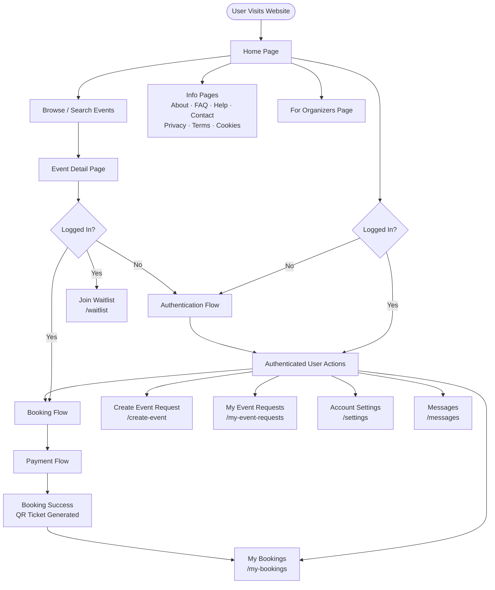
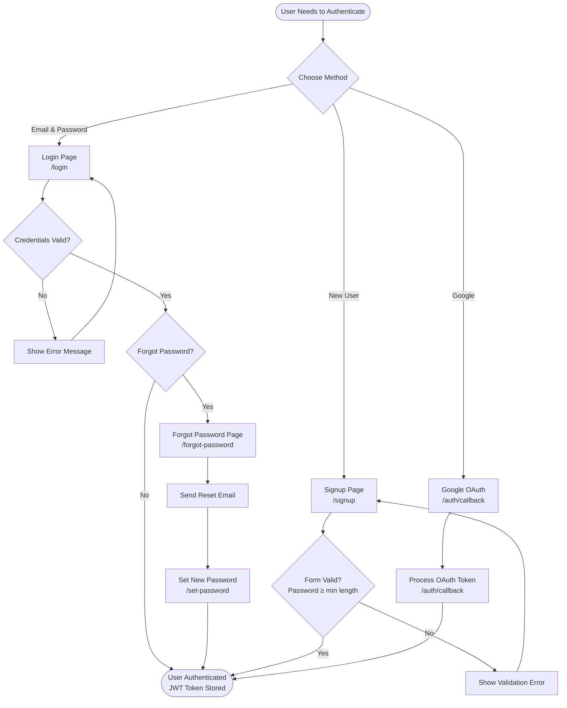
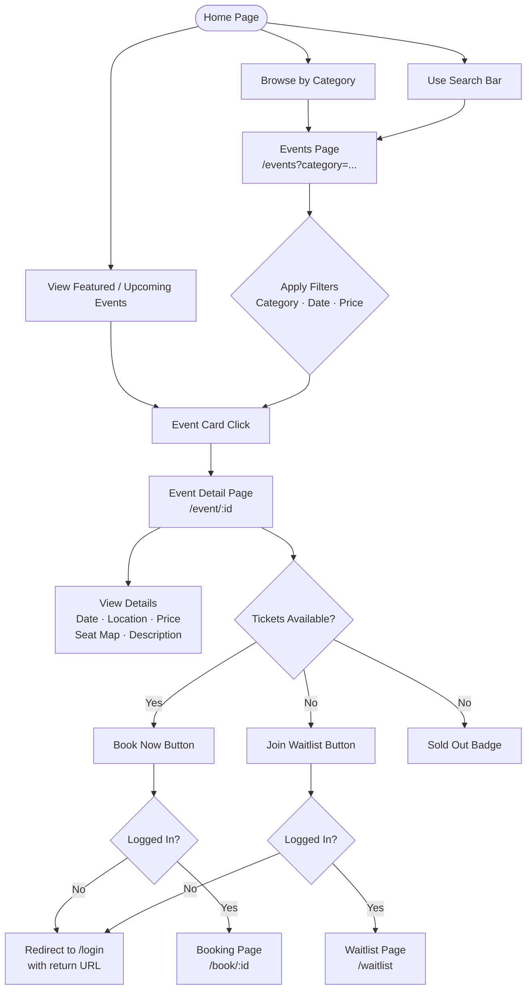
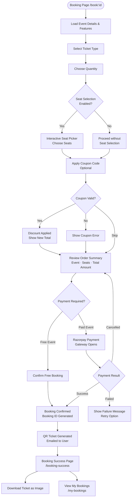
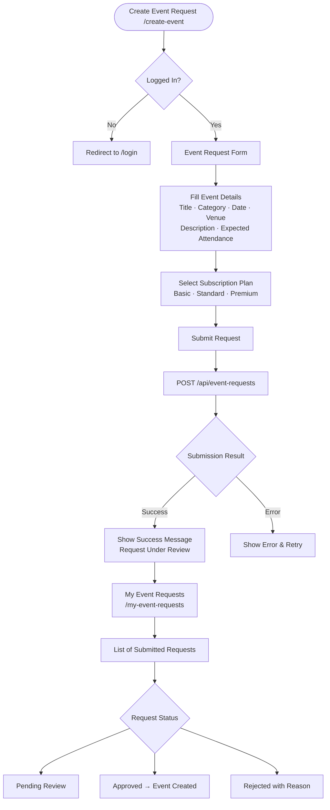

# Public Website System Flow Chart

This document describes the complete system flow for end users interacting with the K&M Event Management public website.

---

## 1. Top-Level User Journey



---

## 2. Authentication Flow



---

## 3. Event Discovery Flow



---

## 4. Booking & Payment Flow



---

## 5. My Bookings Flow

```mermaid
flowchart TD
    MyBookings([My Bookings /my-bookings]) --> LoadBookings[Load User Bookings from API]

    LoadBookings --> HasBookings{Has Bookings?}
    HasBookings -- No --> EmptyState[Show Empty State\nLink to Browse Events]
    HasBookings -- Yes --> BookingList[Display Booking Cards\nEvent · Date · Seats · Status]

    BookingList --> SelectBooking[Select a Booking]
    SelectBooking --> ViewTicket[View QR Ticket]
    SelectBooking --> DownloadTicket[Download Ticket]

    EmptyState --> EventsPage[/events]
```

---

## 6. Create Event Request Flow



---

## 7. Complete Public Website Page Map

```mermaid
flowchart LR
    subgraph Public["🌐 Public Pages (No Login Required)"]
        Home[/ Home]
        Events[/events]
        EventDetail[/event/:id]
        About[/about]
        Contact[/contact]
        FAQ[/faq]
        Help[/help]
        Privacy[/privacy]
        Terms[/terms]
        Cookies[/cookies]
        ForOrganizers[/for-organizers]
        BookingSuccess["/booking-success\n(reads from localStorage / state)"]
    end

    subgraph Auth["🔐 Authentication Pages"]
        Login[/login]
        Signup[/signup]
        ForgotPassword[/forgot-password]
        AuthCallback[/auth/callback]
        SetPassword[/set-password]
    end

    subgraph Protected["🔒 Protected Pages (Login Required)"]
        Settings[/settings]
        Booking[/book/:id]
        Waitlist[/waitlist]
        CreateEvent[/create-event]
        MyEventReqs[/my-event-requests]
        MyBookings[/my-bookings]
        Messages[/messages]
    end

    Home --> Events
    Home --> About
    Home --> ForOrganizers
    Events --> EventDetail
    EventDetail --> Booking
    EventDetail --> Waitlist
    Booking --> BookingSuccess
    BookingSuccess --> MyBookings
    Login --> Protected
    Signup --> Protected
    AuthCallback --> Protected
```

---

## 8. Data Flow Summary

```
┌─────────────────────────────────────────────────────────────────┐
│                    PUBLIC WEBSITE (React SPA)                    │
├──────────────────────────┬──────────────────────────────────────┤
│   UNAUTHENTICATED USER   │         AUTHENTICATED USER           │
│                          │                                       │
│  • Browse Events         │  • Book Tickets (Razorpay / Free)    │
│  • View Event Detail     │  • Apply Coupon Codes                │
│  • View Info Pages       │  • Select Seats (if enabled)         │
│  • Login / Signup        │  • Download QR Ticket                │
│  • Google OAuth          │  • View My Bookings                  │
│  • Forgot Password       │  • Join Waitlist                     │
│                          │  • Submit Event Request              │
│                          │  • Track Event Request Status        │
│                          │  • Update Account Settings           │
│                          │  • View Messages                     │
└──────────────────────────┴──────────────────────────────────────┘
                           │
                           │ REST API (HTTPS)
                           ▼
┌─────────────────────────────────────────────────────────────────┐
│                    BACKEND (Express.js)                          │
├─────────────────────────────────────────────────────────────────┤
│  /api/events          → Browse & search public events           │
│  /api/auth            → Login, signup, Google OAuth, JWT        │
│  /api/bookings        → Create bookings, fetch user bookings    │
│  /api/payments        → Razorpay order creation & verification  │
│  /api/coupons         → Validate & apply coupon codes           │
│  /api/waitlist        → Join / leave waitlist for events        │
│  /api/event-requests  → Submit & track event creation requests  │
│  /api/users           → User profile & settings                 │
│  /api/messages        → User messages                           │
└─────────────────────────────────────────────────────────────────┘
                           │
                           │ Mongoose ODM
                           ▼
┌─────────────────────────────────────────────────────────────────┐
│                      DATABASE (MongoDB)                          │
├─────────────────────────────────────────────────────────────────┤
│  Users · Events · Bookings · Payments · Coupons                 │
│  EventRequests · Waitlist · Messages · FeatureToggles           │
└─────────────────────────────────────────────────────────────────┘
                           │
              ┌────────────┴────────────┐
              ▼                         ▼
┌─────────────────────┐   ┌────────────────────────┐
│  Razorpay Gateway   │   │  Email Service          │
│  (Payment)          │   │  (Booking Confirmation  │
└─────────────────────┘   │   & QR Ticket)          │
                          └────────────────────────┘
```
