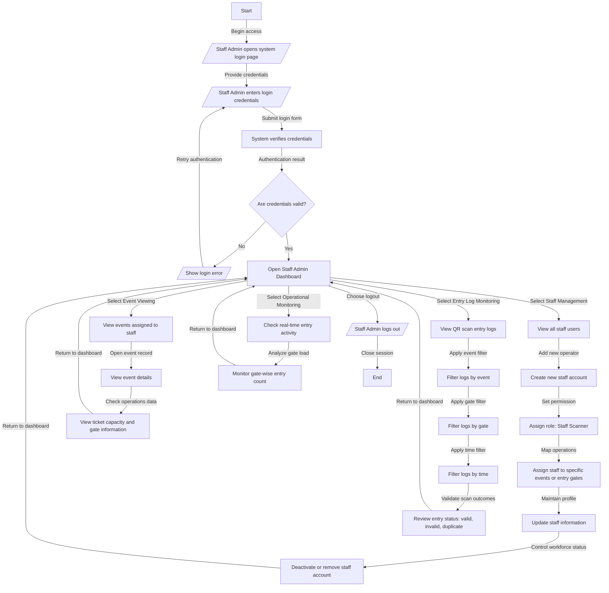

```mermaid
flowchart TD
    A[Start] -->|Begin access| B[/Staff Admin opens system login page/]
    B -->|Provide credentials| C[/Staff Admin enters login credentials/]
    C -->|Submit login form| D[System verifies credentials]
    D -->|Authentication result| E{Are credentials valid?}

    E -->|No| F[/Show login error/]
    F -->|Retry authentication| C

    E -->|Yes| G[Open Staff Admin Dashboard]

    G -->|Select Staff Management| H[View all staff users]
    H -->|Add new operator| I[Create new staff account]
    I -->|Set permission| J[Assign role: Staff Scanner]
    J -->|Map operations| K[Assign staff to specific events or entry gates]
    K -->|Maintain profile| L[Update staff information]
    L -->|Control workforce status| M[Deactivate or remove staff account]
    M -->|Return to dashboard| G

    G -->|Select Event Viewing| N[View events assigned to staff]
    N -->|Open event record| O[View event details]
    O -->|Check operations data| P[View ticket capacity and gate information]
    P -->|Return to dashboard| G

    G -->|Select Entry Log Monitoring| Q[View QR scan entry logs]
    Q -->|Apply event filter| R[Filter logs by event]
    R -->|Apply gate filter| S[Filter logs by gate]
    S -->|Apply time filter| T[Filter logs by time]
    T -->|Validate scan outcomes| U[Review entry status: valid, invalid, duplicate]
    U -->|Return to dashboard| G

    G -->|Select Operational Monitoring| V[Check real-time entry activity]
    V -->|Analyze gate load| W[Monitor gate-wise entry count]
    W -->|Return to dashboard| G

    G -->|Choose logout| X[/Staff Admin logs out/]
    X -->|Close session| Y[End]
```