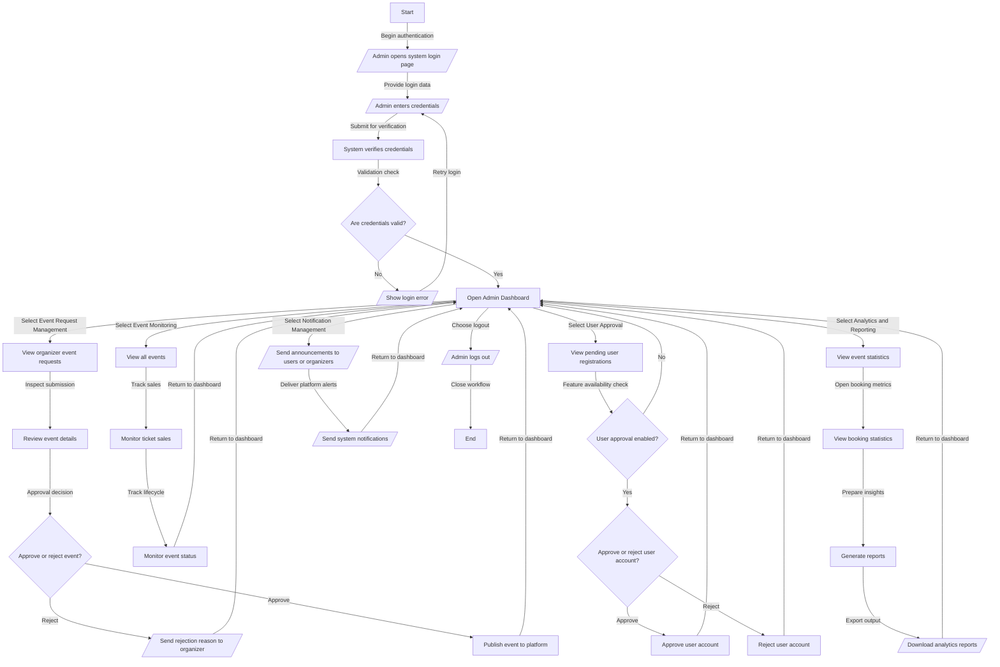

```mermaid
flowchart TD
    A[Start] -->|Begin authentication| B[/Admin opens system login page/]
    B -->|Provide login data| C[/Admin enters credentials/]
    C -->|Submit for verification| D[System verifies credentials]
    D -->|Validation check| E{Are credentials valid?}

    E -->|No| F[/Show login error/]
    F -->|Retry login| C

    E -->|Yes| G[Open Admin Dashboard]

    G -->|Select Event Request Management| H[View organizer event requests]
    H -->|Inspect submission| I[Review event details]
    I -->|Approval decision| J{Approve or reject event?}
    J -->|Reject| K[/Send rejection reason to organizer/]
    K -->|Return to dashboard| G
    J -->|Approve| L[Publish event to platform]
    L -->|Return to dashboard| G

    G -->|Select Event Monitoring| M[View all events]
    M -->|Track sales| N[Monitor ticket sales]
    N -->|Track lifecycle| O[Monitor event status]
    O -->|Return to dashboard| G

    G -->|Select User Approval| P[View pending user registrations]
    P -->|Feature availability check| Q{User approval enabled?}
    Q -->|No| G
    Q -->|Yes| R{Approve or reject user account?}
    R -->|Approve| S[Approve user account]
    R -->|Reject| T[Reject user account]
    S -->|Return to dashboard| G
    T -->|Return to dashboard| G

    G -->|Select Analytics and Reporting| U[View event statistics]
    U -->|Open booking metrics| V[View booking statistics]
    V -->|Prepare insights| W[Generate reports]
    W -->|Export output| X[/Download analytics reports/]
    X -->|Return to dashboard| G

    G -->|Select Notification Management| Y[/Send announcements to users or organizers/]
    Y -->|Deliver platform alerts| Z[/Send system notifications/]
    Z -->|Return to dashboard| G

    G -->|Choose logout| AA[/Admin logs out/]
    AA -->|Close workflow| AB[End]
```